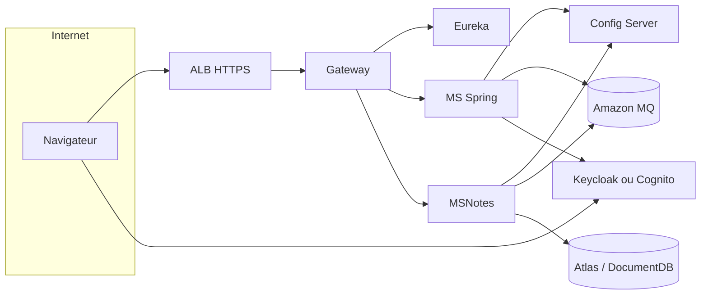

# Déploiement AWS — Twin6 Campus (compatible grille d’évaluation)

Ce document décrit comment porter la stack **Docker** (Eureka, Config Server, Gateway, microservices, Keycloak, MongoDB, RabbitMQ) sur **Amazon Web Services**, et en quoi cela reste **aligné** avec une grille type « Applications Web Distribuées ».

## Compatibilité avec la grille

| Critère grille | En local (Docker) | Sur AWS |
|----------------|-------------------|---------|
| Eureka | Conteneur `eureka` | Même principe : service de découverte dans le VPC (ECS/EC2). |
| Config Server | Conteneur `config-server` | Idem, ou paramètres dans **SSM Parameter Store** / **Secrets Manager** (la grille accepte souvent « config externalisée » en complément). |
| Gateway | Conteneur `gateway` | **Application Load Balancer** en entrée + conteneur gateway, ou **API Gateway** HTTP (noms différents, rôle identique : point d’entrée unique). |
| Sécurité Keycloak + JWT | Keycloak conteneurisé | Keycloak sur **ECS/Fargate** ou **EKS**, ou migration vers **Amazon Cognito** (plus lourd côté adaptation des URLs / audiences). |
| Bases de données | Mongo + Rabbit + H2 (MS Spring) | **MongoDB Atlas** sur AWS ou **Amazon DocumentDB** ; **Amazon MQ for RabbitMQ** ; pour la durabilité des MS Spring, **Amazon RDS** (MySQL/PostgreSQL) en remplacement du H2 (changement de `spring.datasource` via Config Server). |
| Docker / cloud | `docker compose` | **EC2 + Docker Compose** (démo simple) ou **ECS** / **EKS** (production). |
| Valeur ajoutée | CI, monitoring, K8s doc | Déploiement AWS + RDS + MQ + **CloudWatch** + **GitHub Actions** vers ECR/ECS = **CI/CD cloud** très valorisé. |

Conclusion : un déploiement AWS **avec les mêmes briques fonctionnelles** (annuaire, config, passerelle, MS, broker, document, IAM) reste **compatible** avec l’esprit de la grille ; les noms de produits AWS diffèrent mais les **patterns** (discovery, config centralisée, gateway, messages, persistance) sont les mêmes.

## Point critique : URL Keycloak et claim `iss` du JWT

En local, le fichier `docker-compose.full-stack.yml` utilise `host.docker.internal` pour que les conteneurs valident les tokens émis quand le navigateur parle à `http://localhost:8180`.

Sur un serveur AWS :

- Les utilisateurs doivent ouvrir Keycloak sur une URL **publique** (ex. `https://auth.votredomaine.com`).
- Le JWT contient un **`iss`** (issuer) qui doit **exactement** correspondre aux variables `KEYCLOAK_ISSUER_URI` / `KEYCLOAK_JWK_SET_URI` (et équivalents Nest) dans vos services.
- Définissez ces variables vers cette URL publique (ou hostname interne cohérent avec l’émission des tokens), via **Secrets Manager** ou variables d’environnement du task ECS, **pas** `localhost` côté conteneur si le navigateur n’utilise pas la même origine.

Sans cette cohérence, vous obtiendrez des **401** sur la gateway et les MS.

## Option A — Une EC2 + Docker Compose (recommandée pour un projet académique)

1. Créer un VPC (public + subnets privés si possible), un **Security Group** ouvrant **443/80** (ALB ou Nginx), **8180** seulement si vous exposez Keycloak sans reverse proxy (mieux : **HTTPS** derrière un ALB + certificat ACM).
2. Installer Docker + Docker Compose sur **Amazon Linux 2023** ou Ubuntu LTS.
3. Cloner le dépôt, `cd MS`, construire et lancer : `docker compose up -d --build`.
4. Remplacer les URLs Keycloak dans l’environnement des services (fichier `.env` ou override Compose) par l’URL réelle du realm.
5. Bases managées (optionnel mais « pro ») :
   - Créer un cluster **Amazon MQ** (RabbitMQ), mettre à jour `SPRING_RABBITMQ_*` / `RABBITMQ_URI`.
   - **MongoDB Atlas** (région identique) ou DocumentDB ; mettre à jour `MONGODB_URI` pour MSNotes.
   - **RDS** pour les MS Spring si vous sortez du H2 (properties servies par le Config Server).

Avantages : peu de refonte, **Eureka / Config / Gateway / MS** inchangés dans les conteneurs. Inconvénient : une seule machine = point unique (acceptable pour une démo).

## Option B — Amazon ECS (Fargate) + ECR

1. **Docker build** de chaque image (déjà présentes dans le repo) ; push vers **Amazon ECR**.
2. Définir un **ECS Cluster**, des **task definitions** (gateway, chaque MS, eureka, config, keycloak, msnotes).
3. **Service Connect** ou **Cloud Map** pour la découverte de services (équivalent opérationnel d’Eureka côté AWS ; vous pouvez **garder Eureka** dans les tâches pour satisfaire la grille pédagogique).
4. **ALB** ciblant le service `gateway` ; règles de santé sur `/actuator/health` si exposé.

## Option C — Amazon EKS (Kubernetes)

Le dossier `k8s/` du projet documente une approche K8s ; sur AWS cela correspond à **EKS**. C’est la valeur ajoutée « orchestration » la plus visible, au prix d’une complexité plus élevée.

## Schéma logique (résumé)

## Checklist avant soutenance « AWS »

- [ ] URL Keycloak / `iss` JWT alignés avec la configuration des MS et de la gateway.
- [ ] Security groups : minimum nécessaire (pas d’exposition Mongo/Rabbit sur 0.0.0.0/0 en production).
- [ ] Secrets : mots de passe MQ, RDS, client Keycloak dans **Secrets Manager**, pas dans Git.
- [ ] Une capture d’écran ou une URL de démo fonctionnelle (grille + déploiement cloud).

Pour le détail des ports et du démarrage local, voir [`../DOCKER-FULLSTACK.md`](../DOCKER-FULLSTACK.md).
